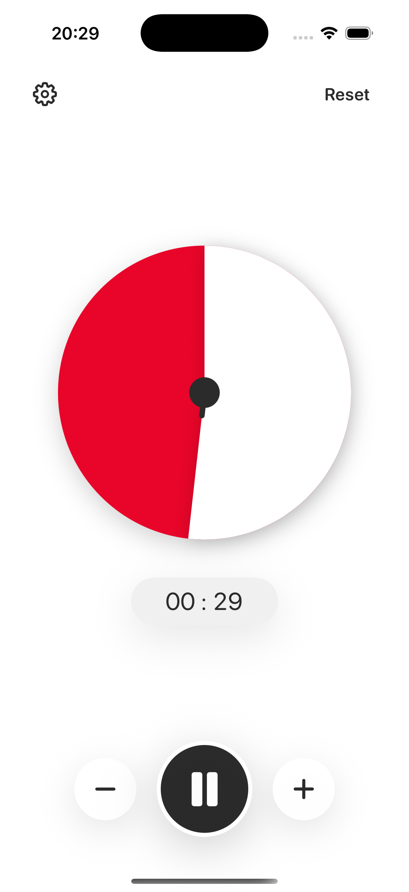

# SneakyTimer

SneakyTimer is a visual timer for parents. Parents can adjust time discreetly while the timer keeps moving smoothly. Settings let parents customize how adjusted time is displayed and how much each tap changes.

<p align="center">
  
</p>

## Install On Your iPhone

You need a Mac, an iPhone, and a USB cable to install SneakyTimer on your iPhone. If you need help, I suggest asking an AI assistant to walk you through it step by step. Just copy and paste this prompt:

```
I want to install an iPhone app from GitHub onto my own iPhone using Xcode. Please guide me one step at a time and wait for me to confirm each step before continuing.

The app is called SneakyTimer. I need help with:
- installing Xcode
- downloading the GitHub repository (https://github.com/guidolang/sneakytimer)
- opening `SneakyTimer.xcodeproj` in Xcode
- selecting my iPhone as the run destination
- setting up Signing & Capabilities with my Apple ID
- changing the bundle identifier if necessary
- running the app on my iPhone
- enabling Developer Mode or trusting the developer account if iOS asks

Also explain that without an active Apple Developer Program membership, the app will need to be reinstalled after 7 days.
```


## Development

Build:

```sh
xcodebuild build -project SneakyTimer.xcodeproj -scheme SneakyTimer -destination 'platform=iOS Simulator,name=iPhone 17'
```

Test:

```sh
xcodebuild test -project SneakyTimer.xcodeproj -scheme SneakyTimer -destination 'platform=iOS Simulator,name=iPhone 17'
```

## Privacy

SneakyTimer does not collect, store, or transmit personal data. Everything is stored locally on the device.

## Support

For support, bug reports, or feature requests, please open a [GitHub issue](https://github.com/guidolang/sneakytimer/issues).
